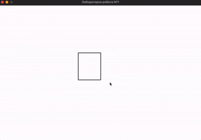
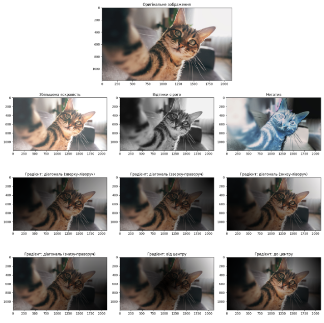
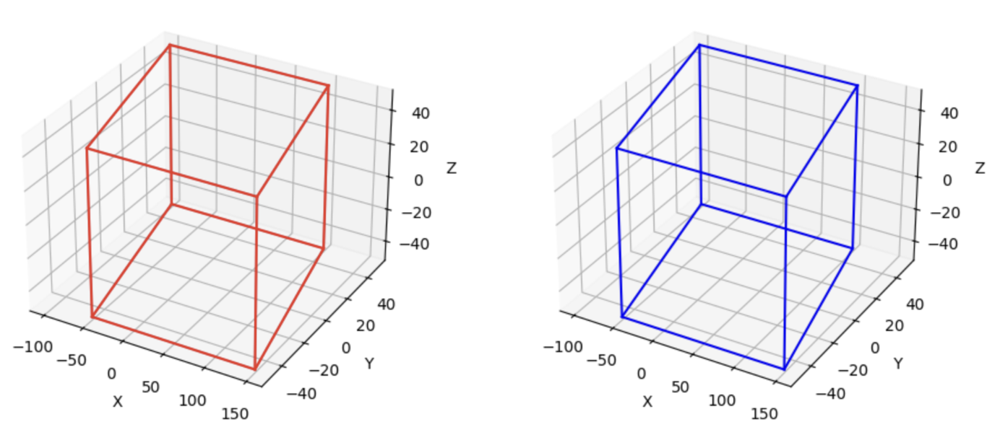
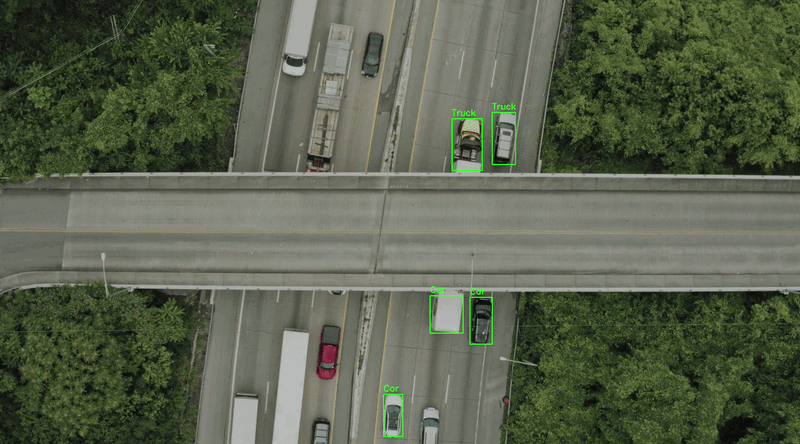
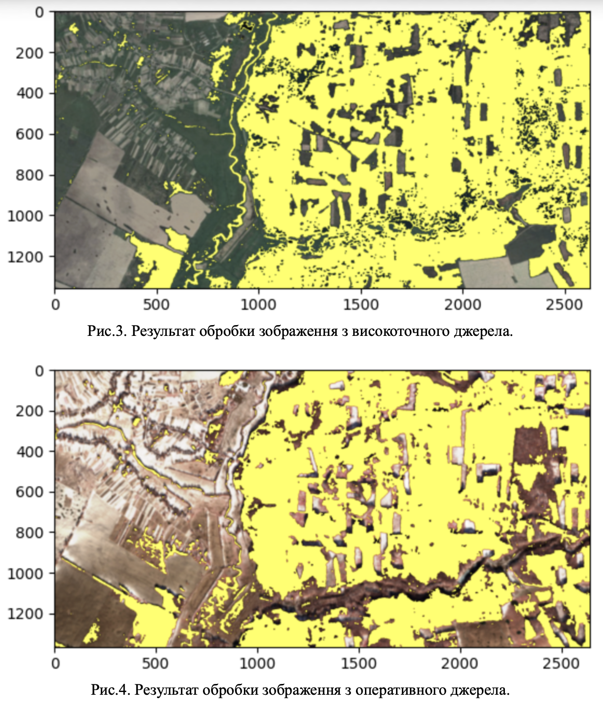
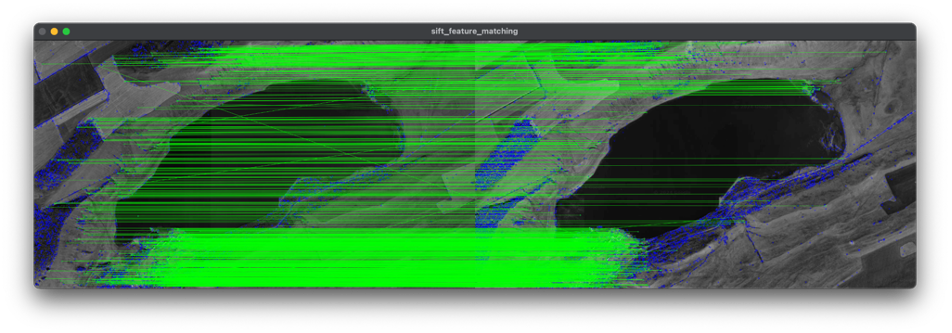
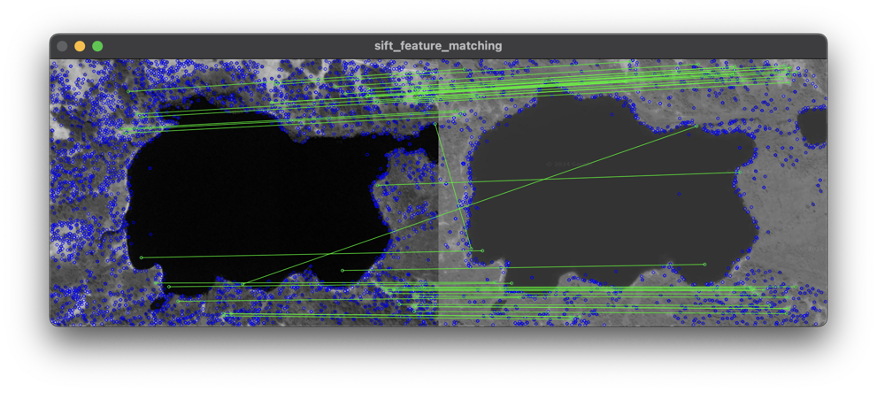
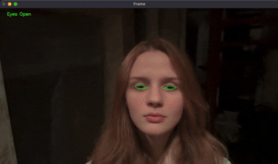
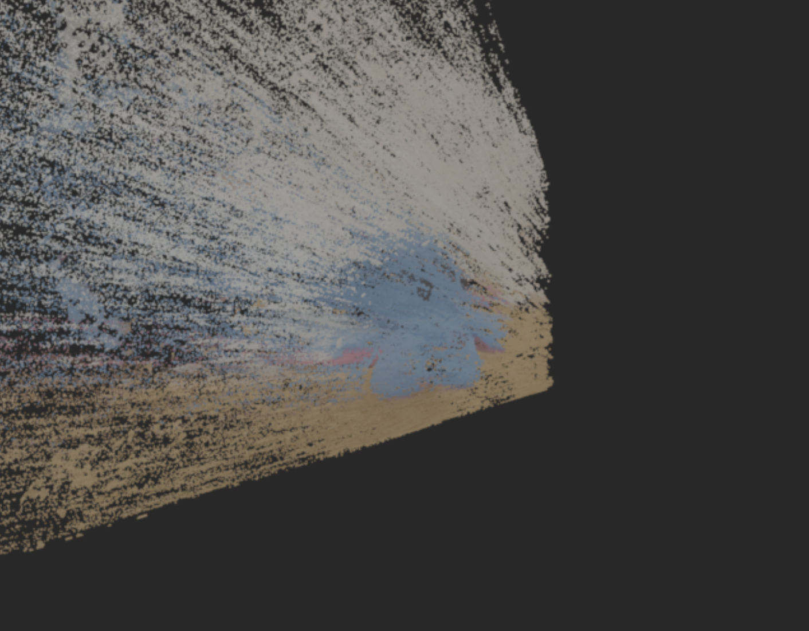
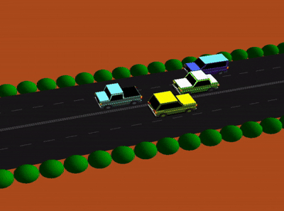

# Технології Computer Vision 

Цей репозиторій містить колекцію звітів з лабораторних робіт, виконаних у рамках курсу з дисципліни «Технології Computer Vision».

Проєкти охоплюють широкий спектр задач комп'ютерного зору: від базової обробки растрових і векторних зображень до складних систем трекінгу, стереозору та генерації 3D-моделей.

---

## Стек технологій
* **Мови програмування:** Python
* **Бібліотеки Computer Vision:** OpenCV, SIFT, FLANN, Haar Cascades
* **Обробка даних та візуалізація:** NumPy, Pandas, Matplotlib, Pygame
* **Робота з 3D та AR:** OpenGL, GLUT, StereoSGBM
* **Інструменти:** Git, PyCharm

---

## Зміст репозиторію

### 1. [Побудова та перетворення координат 2D і 3D об'єктів](./lab1-2d-3d-transformations/Яковенко_Дарʼя_ІА-12_1.docx)
##### [Посилання на код](./lab1-2d-3d-transformations/CV_lab1/Lab1.py)
Дослідження технологій формування геометричних об'єктів. Програмна реалізація просторових трансформацій: обертання, масштабування та центрування фігур у реальному часі за допомогою матричних перетворень.
* **2D/3D Transformations, Matrix Math, Pygame**

### 2. [Формування та обробка растрових цифрових зображень](./lab2-raster-processing/Яковенко_Дарʼя_ІА-12_2.docx)
##### [Посилання на код](./lab2-raster-processing/CV_lab2/lab2.py)
Робота з колірними просторами та генерація складних растрових об'єктів. Реалізація алгоритмів побудови градієнтів (діагональних, від центру, до центру) та застосування технологій корекції характеристик кольору.
* **Image Processing, Rasterization, Color Spaces, OpenCV**

### 3. [Обробка векторних зображень та криві Безьє](./lab3-vector-graphics/Яковенко_Дарʼя_ІА-12_3.pdf)
##### [Посилання на код](./lab3-vector-graphics/CVLab3/lab3_bezierParallelepiped.py)
Дослідження алгоритмів інтерполяції та згладжування складних просторових об'єктів. Побудова 3D-паралелепіпеда з використанням методу інтерполяції кривими Безьє та реалізація механізмів обробки граней.
* **Vector Graphics, Bezier Curves, 3D Object Smoothing, Matplotlib 3D**

### 4. [Покращення якості зображень та детекція об'єктів](./lab4-image-enhancement/Яковенко_Дарʼя_ІА-12_4.docx)
##### [Посилання на код](./lab4-image-enhancement/CVLab4/lab4.py)
Обробка відеопотоку в реальному часі. Реалізація алгоритму для виявлення рухомих об'єктів та їх класифікації (Car / Truck) на основі габаритних розмірів (bounding boxes) із накладанням відповідних підписів.
* **Video Frame Processing, Object Detection, Bounding Boxes, OpenCV**

### 5. [Сегментація та кластеризація: Аналіз супутникових знімків](./lab5-segmentation-clustering/Яковенко_Дарʼя_ІА-12_5.pdf)
##### [Посилання на код](./lab5-segmentation-clustering/CVLab5/Lab5.py)
Розробка системи для аналізу знімків дистанційного зондування Землі (ДЗЗ). Застосування методів колірної сегментації (настроювання меж RGB/HSV) для розпізнавання лісових насаджень та автоматичного підрахунку їх площі на зображенні.
* **Image Segmentation, Clustering, Satellite Imagery Analysis (DZZ)**

### 6. [Трекінг об'єктів у відеопотоці (SIFT & Haar Cascades)](./lab6-object-tracking/Яковенко_Дарʼя_ІА-12_6.docx)
##### [Посилання на код](./lab6-object-tracking)
Використання методу SIFT для виявлення ключових точок та FLANN для їх порівняння між кадрами. Додатково реалізовано алгоритм розпізнавання автомобільних номерних знаків у відеопотоці за допомогою каскадів Хаара.
* **Feature Extraction, SIFT, FLANN, Haar Cascades, Object Tracking**

### 7. [Ідентифікація об'єктів нейромережами: Моніторинг стану водія](./lab7-object-identification/Яковенко_Дарʼя_ІА-12_7.docx)
##### [Посилання на код](./lab7-object-identification)
Розробка системи комп'ютерного зору для безпеки дорожнього руху. Аналіз відеопотоку для моніторингу стану очей водія. У разі виявлення тривалого закриття очей (ознаки засинання) система автоматично генерує звуковий сигнал тривоги.
* **Computer Vision, Artificial Neural Networks (ANN), Drowsiness Detection**

### 8. [Тривимірна реконструкція зі стереозображень](./lab8-3d-reconstruction/Яковенко_Дарʼя_ІА-12_8.pdf)
##### [Посилання на код](./lab8-3d-reconstruction)
Побудова 3D-моделі на основі двох зображень зі стереокамери. Використання алгоритму StereoSGBM для обчислення карти диспаритету (Disparity Map) та генерація тривимірної хмари точок (Point Cloud) з подальшим збереженням у форматі PLY.
* **Stereo Vision, 3D Reconstruction, Disparity Map, Point Cloud, StereoSGBM**

### 9. [Синтез об'єктів доповненої реальності (AR / OpenGL)](./lab9-ar-synthesis/Яковенко_Дарʼя_ІА-12_9.docx)
##### [Посилання на код](./lab9-ar-synthesis/lab9.py)
Створення динамічної тривимірної сцени за допомогою бібліотеки OpenGL. Синтез реалістичної анімації руху автомобіля з метою автоматичної генерації датасетів (синтетичних зображень) для подальшого навчання нейронних мереж розпізнаванню об'єктів.
* **Augmented Reality, OpenGL, GLUT, Synthetic Dataset Generation, 3D Animation**

